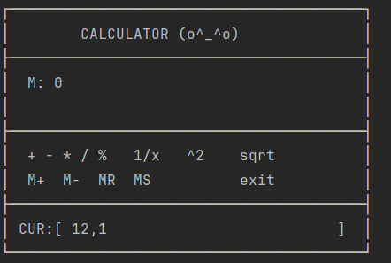

# Емельянова Дарья, ЭФБО-03-24

## 1. Функционал
Консольный калькулятор на C# с текущим значением и памятью.

Поддерживаемые операции:
- Бинарные: `+`, `-`, `*`, `/`, `%`.
- Унарные: `1/x`, `x^2`, `sqrt`.
- Память: `M+` (добавить текущее к памяти),
  `M-` (вычесть текущее из памяти), 
  `MR` (вывести память в текущее), 
  `MS` (сохранить текущее в память).
- Служебные команды: `exit`.

**Особенности интерфейса:**
- Отрисовка дисплея в рамке с текущим значением и памятью.
- Дружелюбные эмоджи в подсказках.
  

## 2. Ограничения
- Числовой тип — `double`.
- Операции выполняются последовательно, без приоритета и скобок.
- Память и состояние сохраняются только на время работы программы.

## 3. Возможные ошибки и их обработка
- Некорректный ввод числа — обрабатывается через double.TryParse, программа просит ввести число повторно при возникновении проблем.
- **Деление на ноль в операциях `/` и `1/x`  — защищено проверкой, выводится сообщение.
- **`sqrt` от отрицательного** — выводится сообщение об ошибке.
- **Неизвестная команда** — выводится сообщение о некорректной операции.
